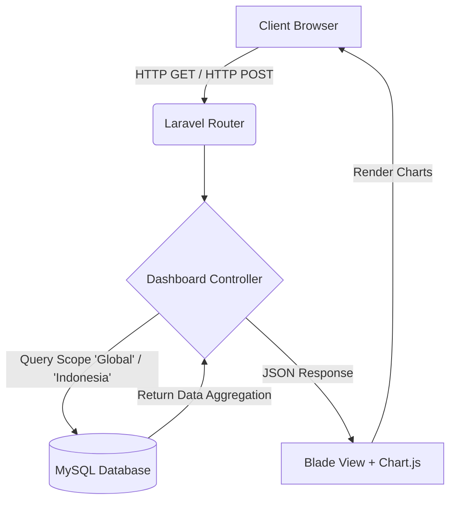
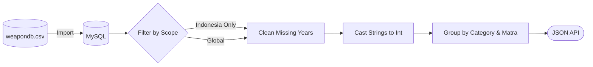
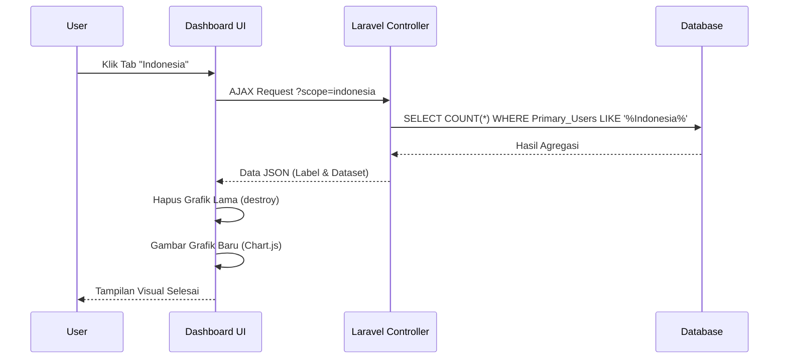

# Analisis Kesiapan dan Kelayakan Alutsista TNI Berbasis Data Persenjataan Global


## 📌 Informasi Proyek
**Mata Kuliah:** Analitik dan Visualisasi Data  
**Institusi:** [Nama Kampus/Universitas]  

**Penulis:**
1. **Muhammad Jabbar Syahrial Reza** (411231096)
2. **Wisnu Widya Pradana** (411231088)

---

## 📖 Ringkasan Proyek (Project Overview)
Proyek ini adalah sebuah aplikasi berbasis web (*dashboard analytics*) yang dirancang untuk menganalisis, memvalidasi, dan memvisualisasikan lebih dari 10.000 data sistem persenjataan (Alutsista) dari 128 negara di seluruh dunia. Tujuan utama dari *dashboard* ini adalah memberikan komparasi atau *benchmark* yang obyektif mengenai **kesiapan dan kelayakan Alutsista Tentara Nasional Indonesia (TNI)** jika dibandingkan dengan tren persenjataan global.

### Latar Belakang & Pernyataan Masalah
Informasi mengenai persenjataan militer umumnya sangat masif dan sulit dipahami secara sekilas. Analisis kekuatan militer suatu negara (terutama Indonesia) tidak bisa hanya dilihat dari "jumlah" senjata, melainkan harus ditinjau dari **usia peralatan**, **efisiensi biaya**, **pengalaman tempur (*combat proven*)**, dan **standar interoperabilitas**. Masalahnya, data mentah ini masih berupa teks/tabel yang sulit dianalisis. Oleh karena itu, diperlukan sistem analitik dan visualisasi data yang mampu mengekstrak *insight* secara interaktif.

### Tujuan Proyek
1. Membersihkan dan menstandardisasi dataset persenjataan global skala besar (10.000+ baris).
2. Membangun visualisasi interaktif untuk menyoroti rasio senjata yang masih aktif versus pensiun.
3. Menganalisis tingkat pengalaman tempur (*combat proven*) Alutsista milik Indonesia.
4. Memberikan evaluasi analitis terkait kekuatan lintas matra (Darat, Laut, Udara).

### Fitur Utama
- **Dual Dashboard View:** Mode *Global* (analisis data dunia) dan mode *Indonesia* (analisis spesifik inventaris TNI).
- **Interactive Visualizations:** Grafik distribusi operasional, tren kronologis, dan sebaran matra berbasis Chart.js.
- **Data Filtering & Scoping:** Filter *real-time* menggunakan AJAX untuk membedah data secara asinkron tanpa *reload* halaman.
- **Responsive Edge-to-Edge Design:** Antarmuka bergaya *enterprise dashboard* yang memanjakan mata dan mudah dibaca (terinspirasi dari Looker Studio).

### Manfaat Sistem
- Membantu pengamat militer dan akademisi untuk memahami postur pertahanan.
- Menjadi landasan argumentasi ilmiah mengenai pentingnya peremajaan Alutsista.
- Memberikan panduan *best-practice* visualisasi data kompleks menjadi grafik yang human-readable.

---

## 📊 Analisis Data

### Dataset Overview
Dataset yang digunakan mencakup `10.000` catatan senjata dari `128` negara. Kolom-kolom utama meliputi:
- `Weapon_Name`, `Category`, `Country_of_Origin`, `Primary_Users`
- `Year_Introduced`, `Year_Retired`, `Service_Status`
- `Unit_Cost_USD`, `Combat_Proven`, `NATO_Compatible`, `Theater_of_Operation`

### Metodologi
Metodologi analisis menggunakan pendekatan **EDA (Exploratory Data Analysis)**:
1. **Data Collection:** Mengumpulkan *raw data* berformat `.csv`.
2. **Data Cleansing:** Menangani *missing values* (seperti `Year_Retired` yang kosong diasumsikan sebagai "Masih Aktif").
3. **Data Transformation:** Merubah format tipe data (misal: *parsing* `Year_Introduced` menjadi *Integer* untuk *sorting* kronologis).
4. **Data Visualization:** Mengonversi agregasi SQL menjadi representasi visual.

### Temuan Utama (Key Findings & Insights)
1. **Dominasi Matra Darat:** Distribusi Alutsista TNI sangat berat pada kategori matra darat (Support Weapon, Small Arm) dibandingkan kekuatan maritim dan udara.
2. **Paradoks Kualitas vs Kuantitas:** Meskipun jumlah senjata aktif TNI tinggi, sebagian besar pengadaannya merupakan alutsista usia tua (lebih dari 30 tahun) yang berisiko mengurangi kapabilitas tempur modern.
3. **Status Tempur:** Rasio alutsista yang sudah *Combat Proven* berada di angka moderat, menunjukkan ketergantungan pada senjata yang teruji secara historis dibandingkan inovasi baru yang berisiko.

---

## 🛠️ Penjelasan Teknis (Technical Documentation)

Berikut adalah bagaimana data diolah di balik layar (tanpa bahasa akademis yang kaku):

1. **Bagaimana Data Masuk:** Data awal berupa file CSV raksasa (`weapondb.csv`). Data ini di-import langsung ke dalam *database* relasional (MySQL) menggunakan *script* / phpMyAdmin agar lebih mudah di-*query*.
2. **Pembersihan Data (Data Cleansing):** 
   - Nilai kosong (*Null/Empty*) pada kolom `Year_Retired` diperlakukan secara logis: jika senjata belum punya tahun pensiun, berarti senjata itu **Masih Aktif**.
3. **Validasi & Transformasi:** 
   - Kolom tahun yang tadinya bertipe *string* diubah secara *on-the-fly* menggunakan fungsi *casting* di Controller (contoh: `CAST(Year_Introduced AS UNSIGNED)` atau `INTEGER`) agar grafik *Line Chart* berurut dari tahun tertua ke terbaru.
   - Pengecekan data *invalid* difilter langsung di level *database* (`WHERE Primary_Users LIKE '%Indonesia%'`).
4. **Visualisasi Data:** Controller Laravel mengumpulkan total (*COUNT*) dari setiap kategori, membungkusnya dalam format JSON, lalu melemparnya ke bagian depan (Front-End). Chart.js lalu menggambar grafik berdasarkan angka-angka JSON tersebut.

---

## 🏗️ Arsitektur & Diagram

### 1. System Architecture Diagram


### 2. Data Processing Flow Diagram


### 3. Analytics & Interaction Workflow


---

## 💻 Teknologi yang Digunakan (Technology Stack)

| Kategori | Teknologi | Tujuan & Alasan Pemilihan |
|---|---|---|
| **Bahasa Pemrograman** | PHP (8.2+), JavaScript (ES6) | Bahasa inti untuk sisi *server* dan interaktivitas klien. |
| **Framework Web** | Laravel 11.x | Mempercepat pengembangan dengan pola arsitektur MVC. |
| **Database** | MySQL / MariaDB | Handal untuk operasi *query* kompleks dan agregasi puluhan ribu baris. |
| **Visualisasi Data** | Chart.js | Ringan, berbasis Canvas, sangat animasi-friendly untuk web. |
| **Styling Framework** | Tailwind CSS | Utility-first CSS untuk membangun UI edge-to-edge *enterprise* secara instan. |
| **Ikonografi** | Phosphor Icons | Menyediakan set ikon profesional bervektor modern. |

---

## 📸 Tangkapan Layar (Screenshots)

Berikut adalah sekilas tampilan *dashboard* (Silakan lihat folder `docs/screenshots/` untuk resolusi penuh):

| Analisis Indonesia | Analisis Global |
|---|---|
|  |  |

*(Catatan: Simpan screenshot tampilan aplikasi Anda di folder `docs/screenshots/` dengan nama `dashboard.png`, `indonesia.png`, dan `global.png`)*

---

## 🚀 Panduan Instalasi (Installation Guide)

### Prasyarat (Semua OS)
- **PHP** >= 8.2
- **Composer** (Package Manager PHP)
- **Node.js & NPM** (Untuk *compile* asset)
- **XAMPP / MySQL Server**

---

### Windows
1. **Clone Repository:**
   ```bash
   git clone <url-repo-anda>
   cd AnalisaPersenjataanAVD
   ```
2. **Install Dependencies:**
   ```bash
   composer install
   npm install
   ```
3. **Setup Environment:**
   Copy file `.env.example` menjadi `.env`.
   ```bash
   copy .env.example .env
   ```
   Buka file `.env` dan pastikan konfigurasi *database* sesuai dengan XAMPP Anda:
   ```env
   DB_CONNECTION=mysql
   DB_HOST=127.0.0.1
   DB_PORT=3306
   DB_DATABASE=analisa_persenjataan
   DB_USERNAME=root
   DB_PASSWORD=
   ```
4. **Buat Database & Import Data:**
   - Buka phpMyAdmin XAMPP (`http://localhost/phpmyadmin`).
   - Buat database dengan nama `analisa_persenjataan`.
   - Lakukan migrasi dari terminal: `php artisan migrate`.
   - Gunakan fitur **Import** phpMyAdmin untuk mengunggah file `weapondb.csv` ke tabel `global_weapons_systems`.
5. **Jalankan Proyek:**
   ```bash
   php artisan key:generate
   php artisan serve
   ```
   Buka `http://localhost:8000` di *browser*.

---

### Linux (Ubuntu / Fedora / Arch)
1. **Clone & Install:**
   ```bash
   git clone <url-repo-anda>
   cd AnalisaPersenjataanAVD
   composer install
   npm install
   ```
2. **Setup Environment:**
   ```bash
   cp .env.example .env
   php artisan key:generate
   ```
   *(Edit file `.env` dan atur DB_CONNECTION ke `mysql` sesuai kredensial MySQL/MariaDB lokal Anda).*
3. **Database Setup:**
   - Buat database: `mysql -u root -p -e "CREATE DATABASE analisa_persenjataan;"`
   - Migrate: `php artisan migrate`
   - Import CSV: Anda bisa mengimport `weapondb.csv` via DBeaver, phpMyAdmin, atau MySQL CLI.
4. **Jalankan Aplikasi:**
   ```bash
   php artisan serve
   ```

---

### macOS
1. **Clone & Install:** Sama seperti langkah Linux. Pastikan Anda memiliki *services* MySQL (misalnya via Homebrew `brew install mysql`).
2. **Setup & Migrate:** Sama seperti Linux. Gunakan DB GUI seperti TablePlus untuk mengimport `weapondb.csv`.
3. **Jalankan Proyek:** `php artisan serve`.

---

## 🛠️ Penyelesaian Masalah (Troubleshooting)

| Gejala (Symptom) | Kemungkinan Penyebab | Langkah Penyelesaian |
|---|---|---|
| **SQLSTATE[HY000] [1049] Unknown database** | Database belum dibuat di MySQL / XAMPP. | Buka phpMyAdmin, buat *database* dengan nama persis seperti di file `.env`. |
| **Grafik tidak muncul (Kosong)** | Data belum ter-import ke tabel `global_weapons_systems`. | Pastikan file `weapondb.csv` sudah berhasil di-import ke tabel tersebut. Cek dengan `SELECT COUNT(*)`. |
| **Vite manifest not found** | File aset frontend belum di-*build*. | Jalankan perintah `npm run dev` atau `npm run build` di terminal baru. |
| **Port 8000 already in use** | Ada *service* lain yang menggunakan port tersebut. | Jalankan dengan port lain: `php artisan serve --port=8080`. |
| **Failed to open stream: Permission denied** | Masalah hak akses (*permission*) pada folder `storage/` dan `bootstrap/cache/` (Khusus Linux/Mac). | Jalankan: `chmod -R 775 storage bootstrap/cache`. |

---

## 🎯 Keterbatasan & Rencana Masa Depan (Limitations & Future Work)
**Keterbatasan Saat Ini:**
- Visualisasi sangat bergantung pada data historis (*static CSV*).
- Kurangnya data rinci mengenai harga pengadaan (*Unit Cost*) untuk senjata spesifik Indonesia.

**Pengembangan Masa Depan:**
- Penambahan fitur *Export to PDF/CSV* agar hasil analisis bisa langsung diunduh oleh para pimpinan militer.
- Integrasi dengan model AI prediktif untuk memprediksi probabilitas pensiun sebuah alutsista di masa mendatang.

---

*Dibuat untuk memenuhi Tugas Akhir Mata Kuliah Analitik dan Visualisasi Data.*
